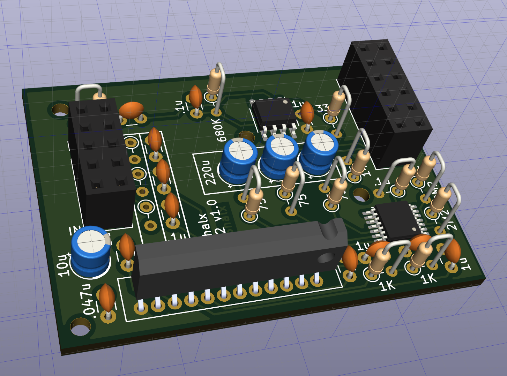

# rgb2component
Cheap RGB to component transcoder based on dekkit schemati  https://github.com/dekkit/RGB-to-Component-Transcoder

   -The main goal for this project is to build a tiny board.
   -Next revisions will replace through hole for smd components
   

